# AWS CloudFormation Lab - Infrastructure as Code (IaC)

## Descrição

Este repositório reúne as atividades desenvolvidas em um laboratório prático de **AWS CloudFormation**, com foco em **Infrastructure as Code (IaC)**.

Durante o laboratório, foi realizado o provisionamento de infraestrutura na AWS utilizando **templates em YAML**, permitindo criar, atualizar e remover recursos de forma automatizada por meio do AWS CloudFormation.

> **Observação:** Este projeto foi desenvolvido em um ambiente de laboratório educacional. O arquivo `template.yaml` presente neste repositório foi recriado para representar os conceitos estudados, sem reproduzir o material oficial do laboratório.

---

## Objetivos

- Provisionar infraestrutura utilizando AWS CloudFormation.
- Criar uma Stack contendo uma Amazon VPC.
- Atualizar a Stack adicionando um Amazon S3 Bucket.
- Atualizar novamente a Stack adicionando uma Amazon EC2 Instance.
- Utilizar Parameters, Resources, Outputs e referências (`!Ref`).
- Aplicar conceitos de Infrastructure as Code (IaC).

---

## Recursos Provisionados

- Amazon VPC
- Public Subnet
- Internet Gateway
- Route Table
- Security Group
- Amazon S3 Bucket
- Amazon EC2 Instance
- Outputs do CloudFormation

---

## Conceitos Praticados

- Infrastructure as Code (IaC)
- AWS CloudFormation
- Templates em YAML
- Parameters
- Resources
- Outputs
- Atualização de Stacks
- AWS Systems Manager Parameter Store
- Referências entre recursos utilizando `!Ref`

---

# Evidências

## Template CloudFormation

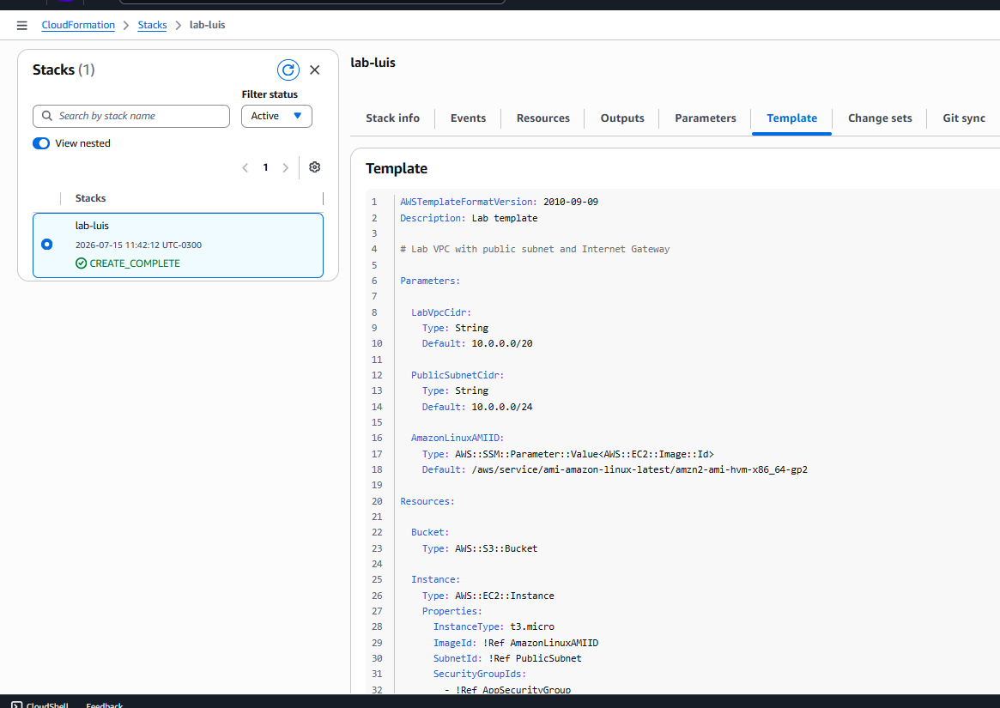

---

## Criação da Stack

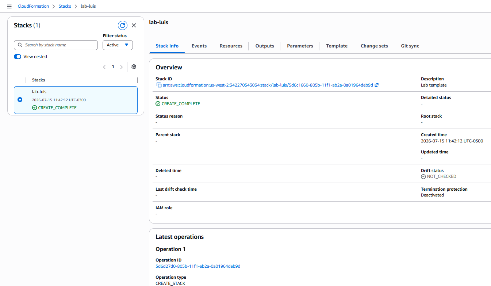

---

## Stack em CREATE_IN_PROGRESS

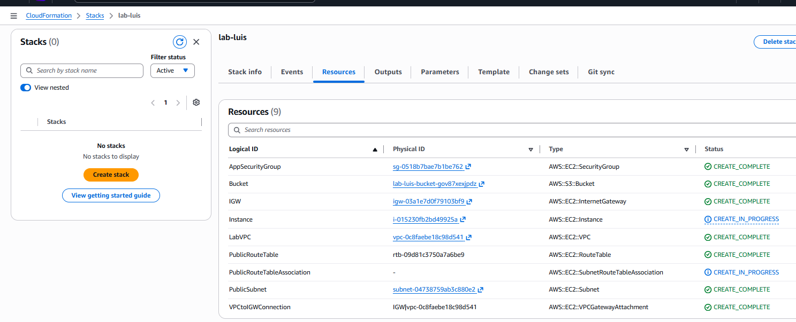

---

## Eventos da Stack

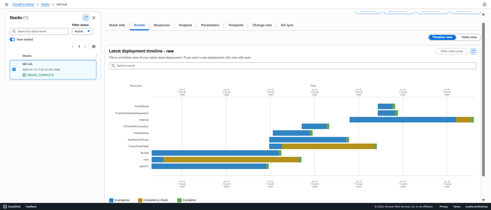

---

## Amazon VPC

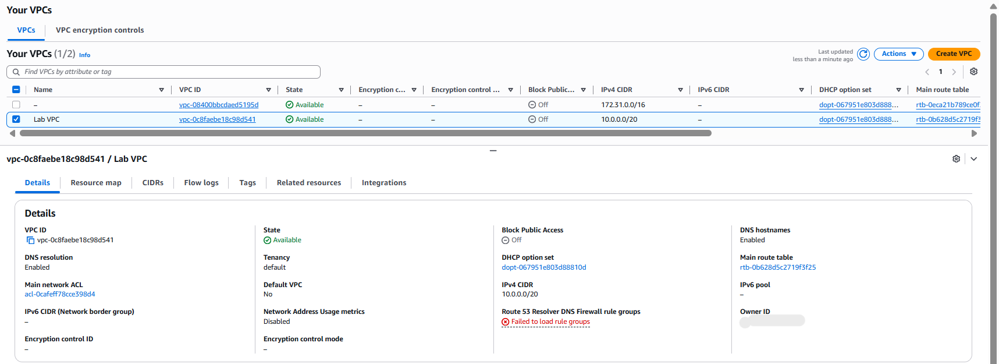

---

## Public Subnet

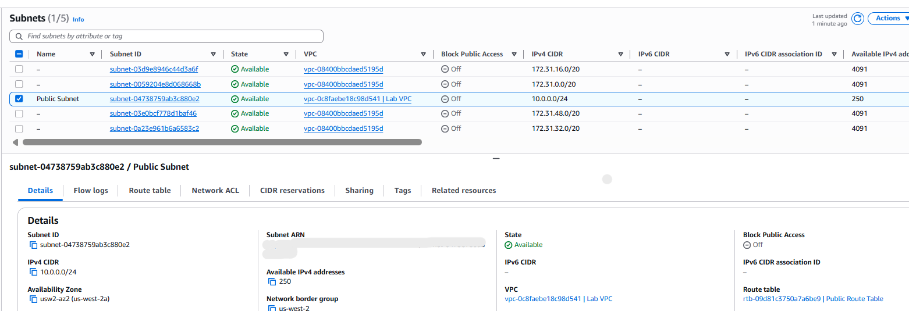

---

## Internet Gateway

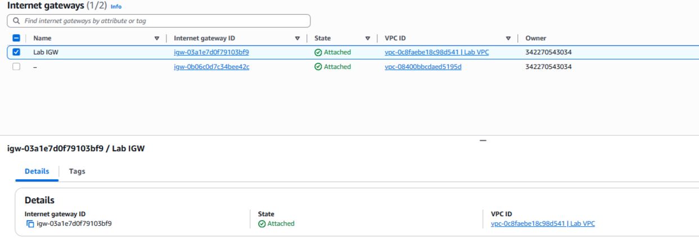

---

## Public Route Table

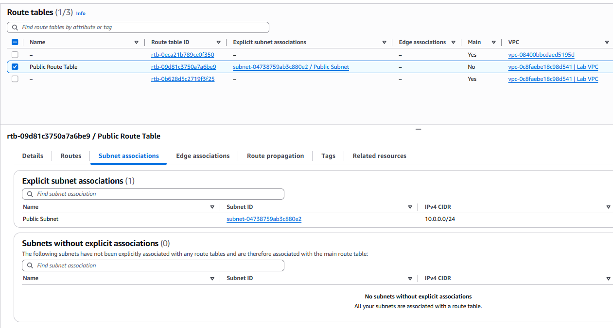

---

## Amazon S3 Bucket

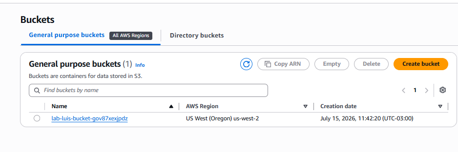

---

## Amazon EC2 Instance

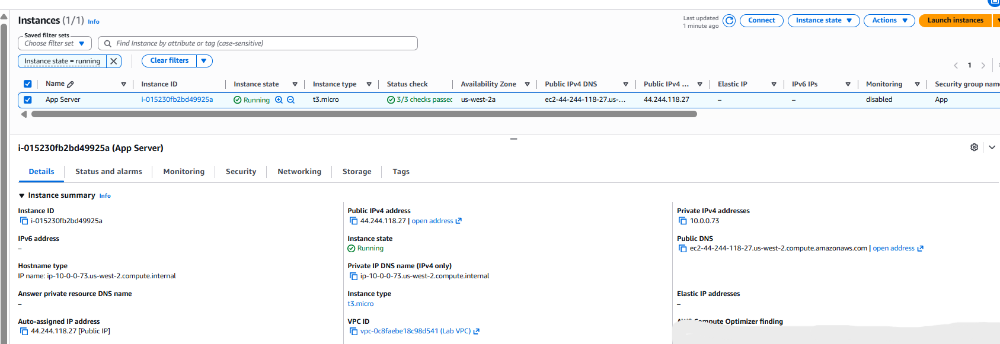

---

## Outputs

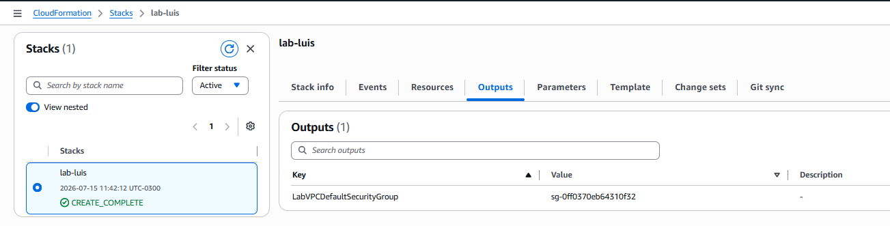

---

## Exclusão da Stack

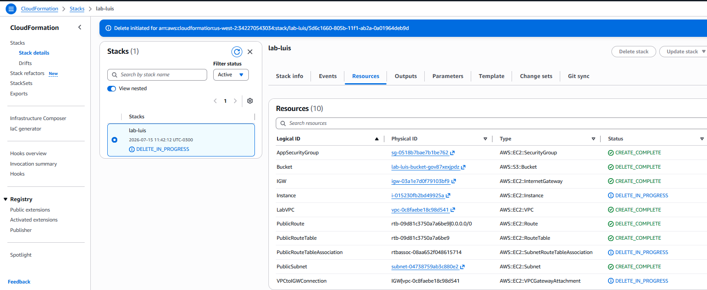

---

## Etapas do Laboratório

### 1. Deploy da Stack

Foi realizado o deploy inicial de uma Stack utilizando um template CloudFormation em YAML para provisionar automaticamente uma infraestrutura de rede contendo uma Amazon VPC e seus recursos associados.

### 2. Atualização da Stack

O template foi atualizado para incluir um **Amazon S3 Bucket**.

Após a atualização, o CloudFormation identificou apenas o novo recurso e realizou sua criação sem recriar toda a infraestrutura existente.

### 3. Inclusão da Amazon EC2

O template foi atualizado novamente para provisionar uma **Amazon EC2 Instance**.

A instância foi configurada utilizando:

- Amazon Linux 2
- AWS Systems Manager Parameter Store para obtenção da AMI
- Security Group existente
- Public Subnet existente
- Instância t3.micro
- Tags para identificação do recurso

### 4. Remoção da Infraestrutura

Ao final do laboratório, a Stack foi excluída.

O AWS CloudFormation removeu automaticamente todos os recursos provisionados durante o laboratório.

---

## Aprendizados

Este laboratório proporcionou experiência prática na utilização do AWS CloudFormation para automatizar o provisionamento de infraestrutura na AWS.

Também foi possível compreender como o CloudFormation facilita o gerenciamento do ciclo de vida da infraestrutura, permitindo criar, atualizar e remover recursos de forma padronizada, reproduzível e escalável utilizando Infrastructure as Code (IaC).

---

## Tecnologias Utilizadas

- AWS CloudFormation
- Amazon EC2
- Amazon VPC
- Amazon S3
- AWS Systems Manager Parameter Store
- YAML
